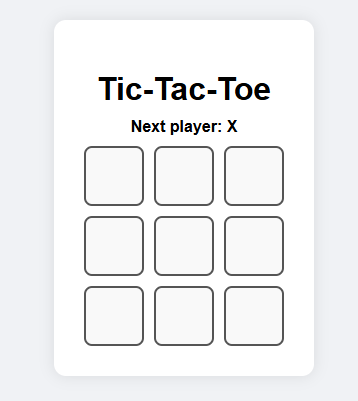

🕹️ Tic-Tac-Toe Game (React)
A simple and fun Tic-Tac-Toe (X and O) game built using React.
Play with a friend and see who gets three in a row first!

🚀 Features
* Two-player mode (X vs O)

* Detects winner or draw

* Easy-to-use interface

* Reset game anytime

🛠️ How to Run
1. Clone this repo:

git clone https://github.com/your-username/tic-tac-toe-react.git
cd tic-tac-toe-react

2. Install dependencies:

npm install

3. Start the app:

npm start

4. Open in your browser:

http://localhost:3000

📁 Project Structure

src/
├── App.jsx        # Main React component
├── App.css        # Styling for the game
└── index.js       # Entry point

✨ Screenshot

📧 Contact
If you have any questions or suggestions:

Name: Ramesh S
Email: srameshonline@gmail.com